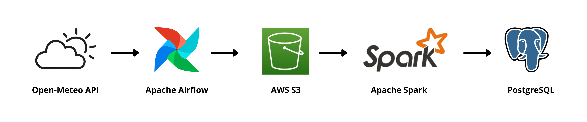
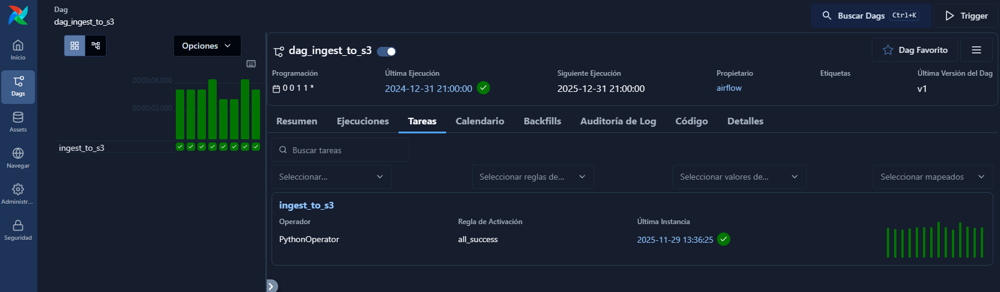
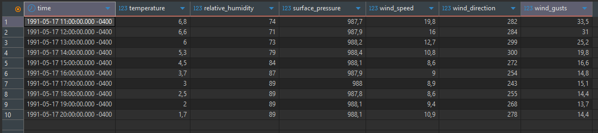
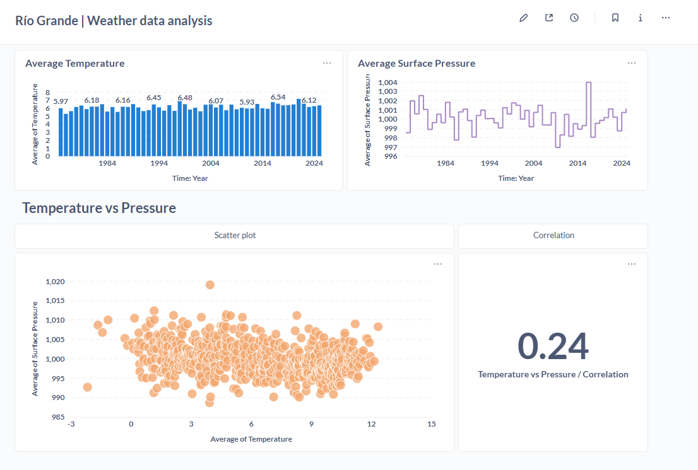

# Patagonia Climate Data Pipeline: End-to-End ETL 1975–2025

**My Flagship Data Engineering Project**

My primary goal was to design and build a scalable, reproducible ETL (Extract, Transform, Load) pipeline to ingest 50 years of hourly meteorological data for the Río Grande region (Tierra del Fuego). This project showcases the complete data lifecycle, from a third-party API to the final BI layer.

## 1. Project Stack




## 2. Infrastructure and Reproducibility

The project runs on a local containerized setup using Airflow, PostgreSQL, Spark (local mode), and Metabase. Below is a structural excerpt of the docker-compose.yml, enough to show the service layout without providing an executable environment.

``` text
# docker-compose.yml (excerpt)
version: "3.9"

services:
  airflow-webserver:
    image: apache/airflow:3.1.3
    command: webserver
    ...

  airflow-scheduler:
    image: apache/airflow:3.1.3
    command: scheduler
    ...

  postgres:
    image: postgres:16
    ...

  spark:
    image: jupyter/pyspark-notebook:spark-3.5.0
    ...

  metabase:
    image: metabase/metabase
    ...

```


***

## 3. Ingestion and Data Lake Strategy

### A. Airflow: Backfilling and Idempotency

I utilized Airflow to manage the full historical backfill starting from 1975. The DAG is intentionally designed to be **idempotent**, allowing for safe retries without duplicating data in the staging area.

**Airflow DAG Snippet (Backfill Configuration):**

```python
from airflow import DAG
from airflow.operators.python import PythonOperator
import requests
import boto3
import botocore
from botocore.exceptions import NoCredentialsError, ClientError
from datetime import datetime, timedelta
import pendulum

BUCKET_NAME = "datariogrande"
LAT = -53.776
LON = -67.703
URL = "https://archive-api.open-meteo.com/v1/archive"

def file_exists(bucket, key):
    s3 = boto3.client("s3")
    try:
        s3.head_object(Bucket=bucket, Key=key)
        return True
    except botocore.exceptions.ClientError:
        return False
    

def ingest_year_to_s3(**context):
    date = context['data_interval_start']
    year = date.year    
    s3 = boto3.client('s3')
    S3_KEY = f"raw/weather/year={year}/riogrande_{year}.json"
    today = datetime.now().date()

    if year == today.year:
        end_date_obj = today - timedelta(days=1)
        end_date_str = end_date_obj.strftime('%Y-%m-%d')
        print(f"Current year detected. Setting end_date to: {end_date_str}")
    else:
        end_date_str = f"{year}-12-31"
    params = {
        "latitude": LAT,
        "longitude": LON,
        "start_date": f"{year}-01-01",
        "end_date": end_date_str,
        "hourly": "temperature_2m,relative_humidity_2m,surface_pressure,wind_speed_10m,wind_direction_10m,wind_gusts_10m",
        "timezone": "America/Argentina/Ushuaia"
    }
    try:
        with requests.get(URL, params=params, stream=True) as response:
            response.raise_for_status() # Stop if error
            response.raw.decode_content = True # Decode GZIP on the fly
            if file_exists(BUCKET_NAME, S3_KEY):
                return "skip"
            s3.upload_fileobj(response.raw, BUCKET_NAME, S3_KEY) 
            

    except Exception as e:
        print(f"❌ Error: {e}")
        raise e

with DAG(
    dag_id='dag_ingest_to_s3',
    start_date=pendulum.datetime(1975, 1, 1, tz="UTC"),
    schedule='@yearly',
    catchup=True,
    max_active_runs=1
) as dag:

    ingest_task = PythonOperator(
        task_id='ingest_to_s3',
        python_callable=ingest_year_to_s3
    )

```

Note: I handle the load **incrementally**. Each batch only inserts the records for its corresponding year using mode("append"), and the warehouse table has a primary key on (time, latitude, longitude). This guarantees that if the pipeline runs again, existing rows are rejected by the database and no duplicates are created. On the ingestion side, Airflow checks whether the yearly JSON file already exists in S3 before uploading it. Together, this gives me practical idempotency without extra tables, state tracking, or complex merge logic.


**Airflow UI Execution Proof:**
This visual confirms the successful completion of the entire 50-year history load, validating the pipeline's robustness.



**Why I chose Airflow**

Airflow was chosen to demonstrate orchestration capabilities, providing built-in features for dependency management, state visibility, execution logging, and crucial retry mechanisms for external API calls, which are features a simple OS Cron scheduler cannot provide.

### B. AWS S3 Staging and Hive Partitioning

Raw JSON files were streamed directly to AWS S3 and organized using the **Hive Partitioning** convention. This decision was made in order to optimize performance.

**AWS S3 Data Lake Structure:**

```text
s3://datariogrande/
└── raw/
    └── weather/
        ├── year=1975/
            └── riogrande_1975.json
        ├── year=1976/
            └── riogrande_1976.json
            .
            .
            .
        ├── year=2024/
            └── riogrande_2024.json
        └── year=2025/
            └── riogrande_2025.json
```

***

## 4. Spark-based batch transformation

This stage addresses the core engineering challenge: transforming the columnar JSON arrays into a normalized, row-oriented table format suitable for SQL analytics.

### A. The Core Logic: Flattening Parallel Arrays

The solution utilizes native Spark functions (`arrays_zip` and `explode`) to convert the nested columnar data into discrete rows, ensuring that the Timestamp and corresponding metrics are correctly aligned in parallel.

**Why I chose Spark**

The dataset doesn’t require distributed processing. I use Spark deliberately to demonstrate that I can structure transformations with its API and execution model. The job runs in local mode and I’m not assuming a cluster deployment. My goal here is to express the logic cleanly and reproducibly, not to claim horizontal scale where it isn’t needed.

**PySpark Transformation Snippet:**


```python
from pyspark.sql import SparkSession
from pyspark.sql.functions import col, explode, arrays_zip, to_timestamp, lit
from pyspark.sql.types import StructType, StructField, StringType, DoubleType, DateType, FloatType, IntegerType, TimestampType
import os

spark = SparkSession.builder \
    .appName("TransformacionClima") \
    .config("spark.jars.packages", "org.postgresql:postgresql:42.7.2,org.apache.hadoop:hadoop-aws:3.3.4,com.amazonaws:aws-java-sdk-bundle:1.12.262") \
    .config("spark.hadoop.fs.s3a.impl", "org.apache.hadoop.fs.s3a.S3AFileSystem") \
    .config("spark.hadoop.fs.s3a.aws.credentials.provider",
            "org.apache.hadoop.fs.s3a.SimpleAWSCredentialsProvider") \
    .config("spark.hadoop.fs.s3a.endpoint", "s3.amazonaws.com") \
    .getOrCreate()

path = "s3a://datariogrande/raw/weather/" 
df_raw = spark.read.json(path)
df_zipped = df_raw.withColumn("zipped_metrics", 
    arrays_zip(
        col("hourly.time"),
        col("hourly.temperature_2m"),
        col("hourly.relative_humidity_2m"),
        col("hourly.surface_pressure"),
        col("hourly.wind_speed_10m"),
        col("hourly.wind_direction_10m"),
        col("hourly.wind_gusts_10m")
    )
).drop("hourly")

df_exploded = df_zipped.withColumn("data", explode("zipped_metrics"))

df_final = df_exploded.select(
    col("latitude").alias("latitud").cast(FloatType()),
    col("longitude").alias("longitud").cast(FloatType()),
    col("year").cast(IntegerType()),
    to_timestamp(col("data.time")).alias("time"),
    
    col("data.temperature_2m").alias("temperature").cast(FloatType()),
    col("data.relative_humidity_2m").alias("relative_humidity").cast(FloatType()),
    col("data.surface_pressure").alias("surface_pressure").cast(FloatType()),
    col("data.wind_speed_10m").alias("wind_speed").cast(FloatType()),
    col("data.wind_direction_10m").alias("wind_direction").cast(IntegerType()),
    col("data.wind_gusts_10m").alias("wind_gusts").cast(FloatType())
)

df_final = df_final.filter(col("time").isNotNull())
df_final = df_final.filter((col("temperature") > -60) & (col("temperature") < 60))
df_final = df_final.filter(col("relative_humidity").isNotNull())

df_final.show()

DB_PROPERTIES = {
    "driver": "org.postgresql.Driver"
}

JDBC_URL = "jdbc:postgresql://data_warehouse:5432/clima_db"
TABLE = "weather_data"

df_final.write \
    .mode("append") \
    .jdbc(JDBC_URL, TABLE, properties=DB_PROPERTIES)
```


### B. Final Data Warehouse Load

The clean, final DataFrame is written to the PostgreSQL Data Warehouse using the **JDBC connector**, ensuring proper schema mapping and reliable bulk transfer.

**PostgreSQL Table Head:**



**Why I chose PostgreSQL**

The current data volume ($\sim 438\text{K}$ rows) is small, allowing PostgreSQL to serve as an efficient, self-contained Data Mart within the Docker environment, simplifying setup and avoiding the unnecessary cost and management overhead of distributed cloud warehouses like Redshift or Snowflake.


***

## 5. Data Consumption & Validation

The project concludes by validating the data's quality and accessibility through a standard BI tool.

### Metabase Dashboard Proof

The dashboard provides visual confirmation that the data is correctly aggregated, parsed, and ready for analysis.




**Dashboard Validation Highlights:**
The dashboard proves that the **Type Casting** was successful (enabling `AVG` calculations) and confirms the data is suitable for advanced analytical queries across the full 50-year history.
