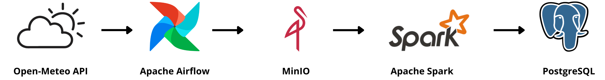
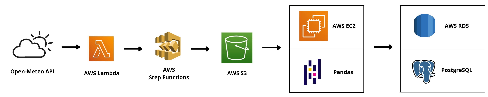
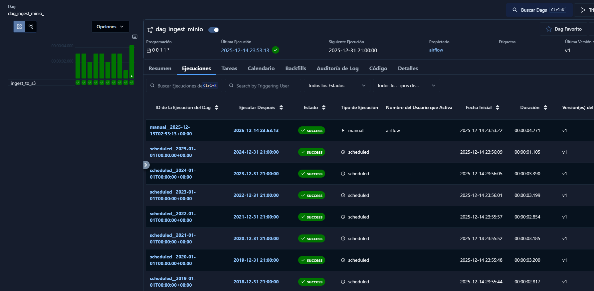
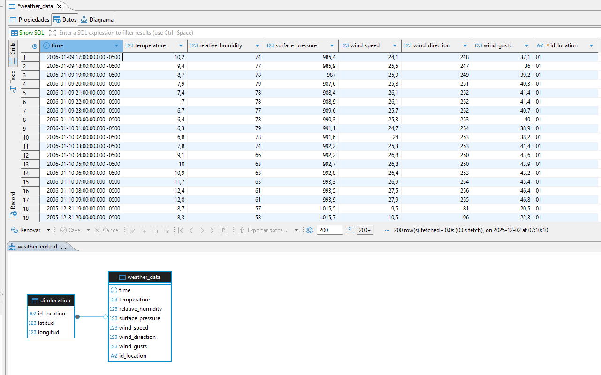
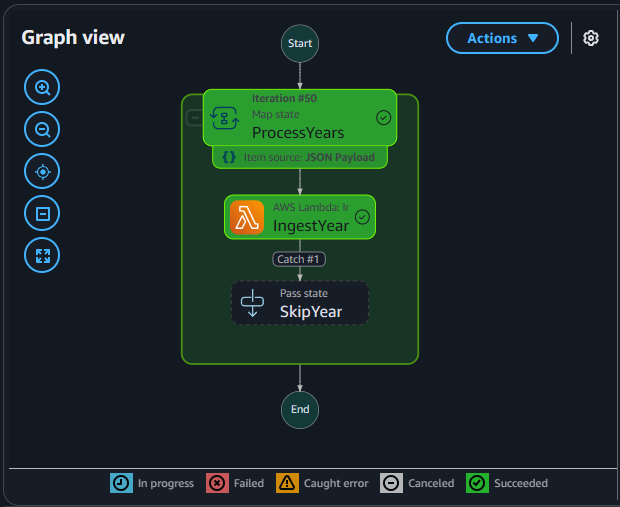
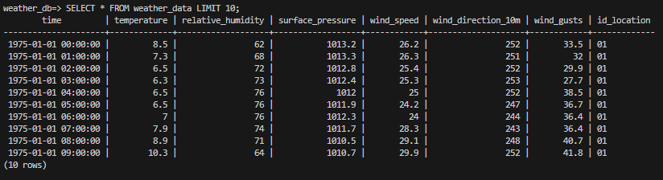

<details>
  <summary style="cursor:pointer"><strong>Versión en español:</strong>
  </summary>
  
  # Proyecto de Arquitectura ETL: Comparación Cloud-Native vs. Contenedores locales


  **Objetivo del proyecto:** Diseñar, construir y evaluar dos soluciones ETL completas para procesar 50 años de datos meteorológicos por hora, comparando un entorno local con contenedores (control total) y una arquitectura serverless en la nube (AWS, máxima escala).

  **Caso:** Se extraen datos meteorológicos horarios desde la API pública de Open-Meteo para el período 1975–2025, mediante 50 consultas anuales consecutivas. Los datos se almacenan inicialmente en un Data Lake que actúa como área de staging, desde donde se procesan y cargan en un Data Warehouse para su posterior uso analítico.

  ---

  ## Presentación de los modelos

  El proyecto se centró en resolver el mismo problema (ingesta y limpieza de datos históricos) usando dos enfoques radicalmente distintos, simulando cómo elegiría la tecnología en el mundo real.

  | Componente | Modelo 1: Contenedores Locales (Control y Flexibilidad) | Modelo 2: Serverless AWS (Escala y Cero Mantenimiento) |
  | :--- | :--- | :--- |
  | **Orquestación** | Apache Airflow | AWS Step Functions / AWS Lambda |
  | **Staging area** | MinIO | AWS S3 |
  | **Transformación** | Python / Apache Spark | AWS EC2 / Python / Pandas |
  | **Data Warehouse** | PostgreSQL (Local) |AWS RDS / PostgreSQL |

### Modelo 1


### Modelo 2


  ---

  ## Modelo 1: Pipeline en Contenedores locales

  **Mi Enfoque:** Usar este modelo para garantizar un control absoluto sobre el entorno, las versiones de software, el *debugging* rápido y la ejecución local con costo cero.

  ### 1.1. Infraestructura y orquestación

  Toda la plataforma se levanta con Docker Compose. **La clave es la reproducibilidad**: cualquier equipo puede replicar el entorno completo de forma inmediata, sin dependencias externas ni configuración manual.


  <details>
  <summary style="cursor:pointer"><strong>Excerpt of docker-compose.yml:</strong>
  </summary>

  ``` text
  version: "3.9"

  services:
    airflow-webserver:
      image: apache/airflow:3.1.3
      command: webserver
      ...

    airflow-scheduler:
      image: apache/airflow:3.1.3
      command: scheduler
      ...

    postgres:
      image: postgres:16
      ...

    spark:
      image: jupyter/pyspark-notebook:spark-3.5.0
      ...

    metabase:
      image: metabase/metabase
      ...

  ```
  </details>
  <br>


  <details open>
  <summary style="cursor:pointer"><strong>Airflow UI Execution Proof</strong></summary>
  Esta visualización confirma que la carga completa de los 50 años de historial se ejecutó correctamente, confirmando que se ejecutó repetidas veces sin riesgo a duplicación de archivos.

  

  </details>
  <br>

  <details open>
  <summary style="cursor:pointer"><strong>Staging area en MinIO (misma estructura en AWS S3 del Modelo 2)</strong></summary>

  ```text
  minio://datariogrande/
  └── raw_cloud/
      └── weather/
          ├── year=1975/
              └── riogrande_1975.json
          ├── year=1976/
              └── riogrande_1976.json
              .
              .
              .
          ├── year=2024/
              └── riogrande_2024.json
          └── year=2025/
              └── riogrande_2025.json
  ```


  </details>
  <br>

  **Decisión: Carga Segura y Evitar Duplicados**
  Implementé **controles de duplicación** en dos niveles: 
  1) Airflow chequea si el archivo JSON ya existe en MinIO antes de subirlo, 
  2) La base de datos (PostgreSQL data warehouse) rechaza la inserción de filas duplicadas (gracias a la Primary Key). Esto permite re-ejecutar el pipeline con seguridad.


  ### 1.2. Transformación y carga

  **Decisión: Utilización de Spark para transformación**
  Utilicé Spark para aplicar **procesamiento distribuido**, aún cuando la ejecución se realiza en modo local y sin clúster. La intención no es simular escala donde no hace falta, sino evidenciar el enfoque y las herramientas que usaría en un escenario distribuido real.


  <details>
  <summary style="cursor:pointer"><strong>Transformación utilizando PySpark:</strong>
  </summary>


  ```python
  from pyspark.sql import SparkSession
  from pyspark.sql.functions import col, explode, arrays_zip, to_timestamp, lit
  from pyspark.sql.types import StructType, StructField, StringType, DoubleType, DateType, FloatType, IntegerType, TimestampType
  import os

  spark = SparkSession.builder \
      .appName("TransformacionClima") \
      .config("spark.jars.packages", "org.postgresql:postgresql:42.7.2,org.apache.hadoop:hadoop-aws:3.3.4,com.amazonaws:aws-java-sdk-bundle:1.12.262") \
      .config("spark.hadoop.fs.s3a.impl", "org.apache.hadoop.fs.s3a.S3AFileSystem") \
      .config("spark.hadoop.fs.s3a.aws.credentials.provider",
              "org.apache.hadoop.fs.s3a.SimpleAWSCredentialsProvider") \
      .config("spark.hadoop.fs.s3a.endpoint", "s3.amazonaws.com") \
      .config("spark.hadoop.fs.s3a.endpoint", MINIO_ENDPOINT) \
      .config("spark.hadoop.fs.s3a.access.key", MINIO_ACCESS_KEY) \
      .config("spark.hadoop.fs.s3a.secret.key", MINIO_SECRET_KEY) \
      .config("spark.hadoop.fs.s3a.path.style.access", "true")  \
      .config("spark.hadoop.fs.s3a.connection.ssl.enabled", "false")  \
      .getOrCreate()

  path = "s3a://datariogrande/raw/weather/" 
  df_raw = spark.read.json(path)
  df_zipped = df_raw.withColumn("zipped_metrics", 
      arrays_zip(
          col("hourly.time"),
          col("hourly.temperature_2m"),
          col("hourly.relative_humidity_2m"),
          col("hourly.surface_pressure"),
          col("hourly.wind_speed_10m"),
          col("hourly.wind_direction_10m"),
          col("hourly.wind_gusts_10m")
      )
  ).drop("hourly")

  df_exploded = df_zipped.withColumn("data", explode("zipped_metrics"))

  df_final = df_exploded.select(
      col("latitude").alias("latitud").cast(FloatType()),
      col("longitude").alias("longitud").cast(FloatType()),
      col("year").cast(IntegerType()),
      to_timestamp(col("data.time")).alias("time"),
      
      col("data.temperature_2m").alias("temperature").cast(FloatType()),
      col("data.relative_humidity_2m").alias("relative_humidity").cast(FloatType()),
      col("data.surface_pressure").alias("surface_pressure").cast(FloatType()),
      col("data.wind_speed_10m").alias("wind_speed").cast(FloatType()),
      col("data.wind_direction_10m").alias("wind_direction").cast(IntegerType()),
      col("data.wind_gusts_10m").alias("wind_gusts").cast(FloatType())
  )

  df_final = df_final.filter(col("time").isNotNull())
  df_final = df_final.filter((col("temperature") > -60) & (col("temperature") < 60))
  df_final = df_final.filter(col("relative_humidity").isNotNull())

  df_final.show()

  DB_PROPERTIES = {
      "driver": "org.postgresql.Driver"
  }

  JDBC_URL = "jdbc:postgresql://data_warehouse:5432/clima_db"
  TABLE = "weather_data"

  df_final.write \
      .mode("append") \
      .jdbc(JDBC_URL, TABLE, properties=DB_PROPERTIES)

  ```
  </details>
  <br>


  <details open>
  <summary style="cursor:pointer"><strong>Data Warehouse</strong></summary>

  El DataFrame final, ya depurado, se escribe en el Data Warehouse PostgreSQL mediante el conector JDBC, respetando el esquema definido y permitiendo una carga de datos estable.


  

  </details>
  <br>

  ---

  ## Modelo 2: Pipeline cloud y serverless

  **Mi Enfoque:** Diseñar una arquitectura basada en servicios serverless, donde los recursos se consumen únicamente durante la ejecución, evitando la gestión de servidores y optimizando el uso de memoria.

  ### 2.1. Infraestrutura y orquestación

  * **Orquestación:** A diferencia del Modelo local, **AWS Step Functions** reemplaza a Airflow, manejando el flujo secuencial, *timeouts* y reintentos de las tareas de forma nativa en la nube.


  <details open>
  <summary style="cursor:pointer"><strong>Vista de Step functions</strong></summary>

  

  **Decisión:** Para replicar el comportamiento del DAG de Airflow, me aseguré de que las ejecuciones se realicen de forma consecutiva (no simultánea) y haya reintentos en caso de falla antes de pasar al siguiente año.

  </details>
  <br>


  <details>
  <summary style="cursor:pointer"><strong>Función IngestYear:</strong>
  </summary>

  Para implementar la función IngestYear, que se ejecuta de forma repetida desde Step Functions, fue necesario empaquetarla en un archivo .zip junto con sus dependencias (requests y boto3) y cargarla manualmente en AWS Lambda, asegurando que el entorno de ejecución cuente con las librerías necesarias.

  ```python
  def lambda_handler(event, context):
      import requests
      import boto3
      from botocore.exceptions import ClientError
      from datetime import datetime, timedelta

      year = event["year"]

      BUCKET_NAME = "datariogrande"
      LAT = -53.776
      LON = -67.703
      URL = "https://archive-api.open-meteo.com/v1/archive"

      s3 = boto3.client("s3")

      S3_KEY = f"raw_cloud/weather/year={year}/riogrande_{year}.json"

      try:
          s3.head_object(Bucket=BUCKET_NAME, Key=S3_KEY)
          return f"skip_{year}"
      except ClientError:
          pass

      today = datetime.utcnow().date()
      end_date = today - timedelta(days=1) if year == today.year else datetime(year, 12, 31).date()

      params = {
          "latitude": LAT,
          "longitude": LON,
          "start_date": f"{year}-01-01",
          "end_date": end_date.strftime("%Y-%m-%d"),
          "hourly": (
              "temperature_2m,"
              "relative_humidity_2m,"
              "surface_pressure,"
              "wind_speed_10m,"
              "wind_direction_10m,"
              "wind_gusts_10m"
          ),
          "timezone": "America/Argentina/Ushuaia"
      }


      r = requests.get(URL, params=params, stream=True, timeout=30)
      r.raise_for_status()
      r.raw.decode_content = True

      s3.upload_fileobj(r.raw, BUCKET_NAME, S3_KEY)

      return f"ingested_{year}"


  ```
  </details>
  <br>


  <details>
  <summary style="cursor:pointer"><strong>Definición de state machine:</strong>
  </summary>

  ```json
  {
    "StartAt": "ProcessYears",
    "States": {
      "ProcessYears": {
        "Type": "Map",
        "ItemsPath": "$.years",
        "MaxConcurrency": 1,
        "Iterator": {
          "StartAt": "IngestYear",
          "States": {
            "IngestYear": {
              "Type": "Task",
              "Resource": "arn:aws:states:::lambda:invoke",
              "Parameters": {
                "FunctionName": "lambda_weather_ingest",
                "Payload": {
                  "year.$": "$"
                }
              },
              "Retry": [
                {
                  "ErrorEquals": [
                    "Lambda.ServiceException",
                    "Lambda.AWSLambdaException",
                    "Lambda.SdkClientException",
                    "Lambda.TooManyRequestsException",
                    "States.TaskFailed"
                  ],
                  "IntervalSeconds": 2,
                  "MaxAttempts": 3,
                  "BackoffRate": 2
                }
              ],
              "Catch": [
                {
                  "ErrorEquals": [
                    "States.ALL"
                  ],
                  "Next": "SkipYear",
                  "ResultPath": "$.error-info"
                }
              ],
              "End": true
            },
            "SkipYear": {
              "Type": "Pass",
              "Result": "Year Skipped after Retries",
              "End": true
            }
          }
        },
        "End": true
      }
    }
  }

  ```
  </details>
  <br>


  ### 2.2. Transformación y carga

  **Decisión: Uso de Pandas en lugar de Spark**
  En el entorno serverless opté por Pandas ya que, para este volumen de datos, **utilizar un clúster Spark gestionado no estaría justificado en términos de costo**. El procesamiento se realiza de forma incremental, año por año, trabajando cada archivo JSON de manera independiente. De esta forma **se evita cargar el histórico completo en memoria**, manteniendo un uso acotado de RAM y permitiendo que la ejecución sea eficiente dentro de las limitaciones de Lambda o una instancia EC2 liviana.


  <details>
  <summary style="cursor:pointer"><strong>Python/Pandas snippet</strong> (simplificado)<strong>:</strong>
  </summary>


  ```python
  import boto3, json, pandas as pd
  from sqlalchemy import create_engine

  BUCKET, PREFIX, ID_LOCATION = "datariogrande", "raw_cloud/weather/", "01"
  TABLE = "weather_data"
  JDBC_URL = os.environ.get("WEATHER_DB_URL")


  def get_s3_client(): return boto3.client("s3")
  def get_db_engine(): return create_engine(JDBC_URL)

  def list_json_files(bucket, prefix):
      keys=[]
      for page in get_s3_client().get_paginator("list_objects_v2").paginate(Bucket=bucket, Prefix=prefix):
          keys.extend(obj["Key"] for obj in page.get("Contents",[]) if obj["Key"].endswith(".json"))
      return keys

  def process_and_load_file(key, engine):
      obj = get_s3_client().get_object(Bucket=BUCKET, Key=key)
      data = json.load(obj["Body"])
      h = data.get("hourly",{})
      
      # Transformación de datos (simplificada, se omiten validaciones y columnas extra) [...]
      df = pd.DataFrame({
          "time": pd.to_datetime(h["time"], errors="coerce"),
          "temperature": h["temperature_2m"],
          "relative_humidity": h["relative_humidity_2m"],
          "surface_pressure": h.get("surface_pressure", []),      # [...]
          "wind_speed": h.get("wind_speed_10m", []),             # [...]
          "wind_direction": h.get("wind_direction_10m", []),     # [...]
          "wind_gusts": h.get("wind_gusts_10m", [])              # [...]
      })
      
      df = df[df["time"].notna() & (df["temperature"].between(-60,60))]
      df["id_location"]=ID_LOCATION
      
      # Carga simplificada a DB [...]
      df.to_sql(TABLE, engine, if_exists="append", index=False)

  def main():
      engine = get_db_engine()
      for key in list_json_files(BUCKET, PREFIX):
          process_and_load_file(key, engine)

  if __name__=="__main__":
      main()


  ```
  </details>
  <br>


  <details open>
  <summary style="cursor:pointer"><strong>Data Warehouse en AWS RDS</strong></summary>

  

  </details>
  <br>

  ---

  ## Análisis Comparativo (Costo vs. Rendimiento)

  | Criterio | Modelo 1: Contenedores Locales | Modelo 2: Serverless AWS | Conclusión Estratégica |
  | :--- | :--- | :--- | :--- |
  | **Costo Operacional (OPEX)** | Cero (local) | Bajo/Variable (pago por uso) | El **Modelo 2** resulta más adecuado cuando las cargas no son constantes, ya que solo se paga por lo que se ejecuta. En este caso, la naturaleza intermitente del pipeline hace que el enfoque serverless tenga más sentido. El **Modelo 1** no implica costos directos en local, pero no ofrece la misma elasticidad. |
  | **Rendimiento / Latencia** | Excelente (cómputo dedicado) | Muy bueno (pero sujeto a límites de RAM de Lambda) | El **Modelo 1** ofrece mejor rendimiento y menor latencia al tener control total del entorno. En el **Modelo 2**, la latencia es mayor pero aceptable para este tipo de procesamiento, a cambio de poder escalar bajo demanda sin intervención manual. |
  | **Mantenimiento** | Alto (requiere aplicar parches al SO, gestionar la VM/EKS) | Bajo (AWS gestiona SO y *patching* por mí) | El **Modelo 2** reduce significativamente las tareas de mantenimiento, ya que la infraestructura y el sistema operativo quedan a cargo de AWS. En contraste, el **Modelo 1** demanda tiempo y atención para mantener el entorno actualizado y operativo. |
  | **Flexibilidad/Control** | Máximo (control sobre cada dependencia) | Limitado (depende de la configuración de AWS) | El **Modelo 1** ofrece mayor control y es útil para probar, ajustar o entender el pipeline en detalle. El **Modelo 2** reduce la carga operativa y simplifica la ejecución en producción, aun con algunas limitaciones propias del entorno cloud. |


</details>

 <br>


<details open>
<summary style="cursor:pointer"><strong>English version:</strong>
</summary>

# ETL Architecture Decisions: Cloud-Native vs. Local Containers

**Project Goal:** Design, build, and compare two ETL solutions for processing 50 years of hourly weather data: one running locally with containers, and another based on a fully serverless AWS architecture.

**Use Case:** Hourly weather data is pulled from the public Open-Meteo API for the period 1975–2025 via 50 consecutive yearly requests. The raw data is first landed in a Data Lake used as a staging area, then processed and loaded into a Data Warehouse for analytics.

---

## Overview of the Two Approaches

The project tackled the same challenge (ingesting and cleaning historical data) with two very different strategies, reflecting common trade-offs faced when choosing data processing technologies.

  | Componente | Model 1: Local Containers (Full Control & Flexibility) | Serverless AWS (Scalability & Zero Maintenance) |
  | :--- | :--- | :--- |
  | **Orchestration** | Apache Airflow | AWS Step Functions / AWS Lambda |
  | **Staging area** | MinIO | AWS S3 |
  | **Transformation** | Python / Apache Spark | AWS EC2 / Python / Pandas |
  | **Data Warehouse** | PostgreSQL (Local) |AWS RDS / PostgreSQL |

### Modelo 1


### Modelo 2


  ---

---

## Model 1: Local Container-Based Pipeline

**My Approach:** This setup provides full control over the environment and software versions, allows fast local debugging, and can be run at zero cost.

### 1.1. Infrastructure and Orchestration

The entire stack is spun up with Docker Compose. The main advantage of this approach is **reproducibility**: the entire environment can be replicated without external dependencies or manual setup.


  <details>
  <summary style="cursor:pointer"><strong>Excerpt of docker-compose.yml:</strong>
  </summary>

  ``` text
  version: "3.9"

  services:
    airflow-webserver:
      image: apache/airflow:3.1.3
      command: webserver
      ...

    airflow-scheduler:
      image: apache/airflow:3.1.3
      command: scheduler
      ...

    postgres:
      image: postgres:16
      ...

    spark:
      image: jupyter/pyspark-notebook:spark-3.5.0
      ...

    metabase:
      image: metabase/metabase
      ...

  ```
  </details>
  <br>


  <details open>
  <summary style="cursor:pointer"><strong>Airflow UI Execution Proof</strong></summary>
This view shows a successful full load of the 50-year dataset and confirms that the pipeline can be safely re-executed without duplicating data.

  

  </details>
  <br>

  <details open>
  <summary style="cursor:pointer"><strong>Staging area in MinIO (same as AWS S3 in Model 2) </strong></summary>

  ```text
  s3://datariogrande/
  └── raw_cloud/
      └── weather/
          ├── year=1975/
              └── riogrande_1975.json
          ├── year=1976/
              └── riogrande_1976.json
              .
              .
              .
          ├── year=2024/
              └── riogrande_2024.json
          └── year=2025/
              └── riogrande_2025.json
  ```


  </details>
  <br>

**Decision: Safe Loading and Preventing Duplicates**
Duplicate protection is handled at two levels:
1) Airflow checks if the JSON file already exists in MinIO before uploading it,
2) The database (PostgreSQL data warehouse) rejects any duplicate rows on insert (thanks to the Primary Key). This allows the pipeline to be re-executed without introducing duplicates.

### 1.2. Transformation and Loading

**Decision: Using Spark for Transformations**
I went with Spark to apply **distributed processing**, even though it's running in local mode without a real cluster. The goal is not to introduce unnecessary scale, but to apply the same processing model that would be used in a distributed environment.


  <details>
  <summary style="cursor:pointer"><strong>Transformación utilizando PySpark:</strong>
  </summary>


  ```python
  from pyspark.sql import SparkSession
  from pyspark.sql.functions import col, explode, arrays_zip, to_timestamp, lit
  from pyspark.sql.types import StructType, StructField, StringType, DoubleType, DateType, FloatType, IntegerType, TimestampType
  import os

  spark = SparkSession.builder \
      .appName("TransformacionClima") \
      .config("spark.jars.packages", "org.postgresql:postgresql:42.7.2,org.apache.hadoop:hadoop-aws:3.3.4,com.amazonaws:aws-java-sdk-bundle:1.12.262") \
      .config("spark.hadoop.fs.s3a.impl", "org.apache.hadoop.fs.s3a.S3AFileSystem") \
      .config("spark.hadoop.fs.s3a.aws.credentials.provider",
              "org.apache.hadoop.fs.s3a.SimpleAWSCredentialsProvider") \
      .config("spark.hadoop.fs.s3a.endpoint", "s3.amazonaws.com") \
      .getOrCreate()

  path = "s3a://datariogrande/raw/weather/" 
  df_raw = spark.read.json(path)
  df_zipped = df_raw.withColumn("zipped_metrics", 
      arrays_zip(
          col("hourly.time"),
          col("hourly.temperature_2m"),
          col("hourly.relative_humidity_2m"),
          col("hourly.surface_pressure"),
          col("hourly.wind_speed_10m"),
          col("hourly.wind_direction_10m"),
          col("hourly.wind_gusts_10m")
      )
  ).drop("hourly")

  df_exploded = df_zipped.withColumn("data", explode("zipped_metrics"))

  df_final = df_exploded.select(
      col("latitude").alias("latitud").cast(FloatType()),
      col("longitude").alias("longitud").cast(FloatType()),
      col("year").cast(IntegerType()),
      to_timestamp(col("data.time")).alias("time"),
      
      col("data.temperature_2m").alias("temperature").cast(FloatType()),
      col("data.relative_humidity_2m").alias("relative_humidity").cast(FloatType()),
      col("data.surface_pressure").alias("surface_pressure").cast(FloatType()),
      col("data.wind_speed_10m").alias("wind_speed").cast(FloatType()),
      col("data.wind_direction_10m").alias("wind_direction").cast(IntegerType()),
      col("data.wind_gusts_10m").alias("wind_gusts").cast(FloatType())
  )

  df_final = df_final.filter(col("time").isNotNull())
  df_final = df_final.filter((col("temperature") > -60) & (col("temperature") < 60))
  df_final = df_final.filter(col("relative_humidity").isNotNull())

  df_final.show()

  DB_PROPERTIES = {
      "driver": "org.postgresql.Driver"
  }

  JDBC_URL = "jdbc:postgresql://data_warehouse:5432/clima_db"
  TABLE = "weather_data"

  df_final.write \
      .mode("append") \
      .jdbc(JDBC_URL, TABLE, properties=DB_PROPERTIES)

  ```
  </details>
  <br>


  <details open>
  <summary style="cursor:pointer"><strong>Data Warehouse</strong></summary>

The clean, final DataFrame is written to the PostgreSQL Data Warehouse using the JDBC connector, keeping the table structure consistent and allowing a stable bulk load.


  

  </details>
  <br>

  ---

## Model 2: Cloud and Serverless Pipeline

**My Approach:** This model is based on serverless services, where resources are only consumed during execution. This eliminates server management and optimizes memory usage.

### 2.1. Infrastructure and Orchestration

* **Orchestration:** Unlike the local model, **AWS Step Functions** takes over from Airflow, handling the sequential flow, timeouts, and task retries natively in the cloud.


<details open>
<summary style="cursor:pointer"><strong>Step functions graph view</strong></summary>


**Decision:** To replicate Airflow’s DAG behavior, executions are configured to run sequentially, with automatic retries before moving on to the next year.

</details>
<br>


<details>
<summary style="cursor:pointer"><strong>IngestYear function overview:</strong>
</summary>

To make the IngestYear function work getting called repeatedly by Step Functions. The function is packaged as a .zip with its dependencies (requests, boto3) to ensure availability in the Lambda runtime. This ensures the runtime environment has all the required libraries.

```python
def lambda_handler(event, context):
    import requests
    import boto3
    from botocore.exceptions import ClientError
    from datetime import datetime, timedelta

    year = event["year"]

    BUCKET_NAME = "datariogrande"
    LAT = -53.776
    LON = -67.703
    URL = "https://archive-api.open-meteo.com/v1/archive"

    s3 = boto3.client("s3")

    S3_KEY = f"raw_cloud/weather/year={year}/riogrande_{year}.json"

    try:
        s3.head_object(Bucket=BUCKET_NAME, Key=S3_KEY)
        return f"skip_{year}"
    except ClientError:
        pass

    today = datetime.utcnow().date()
    end_date = today - timedelta(days=1) if year == today.year else datetime(year, 12, 31).date()

    params = {
        "latitude": LAT,
        "longitude": LON,
        "start_date": f"{year}-01-01",
        "end_date": end_date.strftime("%Y-%m-%d"),
        "hourly": (
            "temperature_2m,"
            "relative_humidity_2m,"
            "surface_pressure,"
            "wind_speed_10m,"
            "wind_direction_10m,"
            "wind_gusts_10m"
        ),
        "timezone": "America/Argentina/Ushuaia"
    }


    r = requests.get(URL, params=params, stream=True, timeout=30)
    r.raise_for_status()
    r.raw.decode_content = True

    s3.upload_fileobj(r.raw, BUCKET_NAME, S3_KEY)

    return f"ingested_{year}"


```
</details>
<br>


<details>
<summary style="cursor:pointer"><strong>State machine definition:</strong>
</summary>

```json
{
  "StartAt": "ProcessYears",
  "States": {
    "ProcessYears": {
      "Type": "Map",
      "ItemsPath": "$.years",
      "MaxConcurrency": 1,
      "Iterator": {
        "StartAt": "IngestYear",
        "States": {
          "IngestYear": {
            "Type": "Task",
            "Resource": "arn:aws:states:::lambda:invoke",
            "Parameters": {
              "FunctionName": "lambda_weather_ingest",
              "Payload": {
                "year.$": "$"
              }
            },
            "Retry": [
              {
                "ErrorEquals": [
                  "Lambda.ServiceException",
                  "Lambda.AWSLambdaException",
                  "Lambda.SdkClientException",
                  "Lambda.TooManyRequestsException",
                  "States.TaskFailed"
                ],
                "IntervalSeconds": 2,
                "MaxAttempts": 3,
                "BackoffRate": 2
              }
            ],
            "Catch": [
              {
                "ErrorEquals": [
                  "States.ALL"
                ],
                "Next": "SkipYear",
                "ResultPath": "$.error-info"
              }
            ],
            "End": true
          },
          "SkipYear": {
            "Type": "Pass",
            "Result": "Year Skipped after Retries",
            "End": true
          }
        }
      },
      "End": true
    }
  }
}

```
</details>
<br>

### 2.2. Transformation and Loading

**Decision: Using Pandas Instead of Spark**
In the serverless setup, I went with Pandas because, for this data volume, a managed Spark cluster would introduce unnecessary cost for this data volume. The processing happens incrementally, year by year, handling each JSON file on its own. This way, **we avoid loading the entire historical dataset into memory**, keeping RAM usage low and making the runs efficient—even within Lambda's limits or on a lightweight EC2 instance.


  <details>
  <summary style="cursor:pointer"><strong>Python/Pandas snippet</strong> (simplified)<strong>:</strong>
  </summary>


  ```python
  import boto3, json, pandas as pd
  from sqlalchemy import create_engine

  BUCKET, PREFIX, ID_LOCATION = "datariogrande", "raw_cloud/weather/", "01"
  TABLE = "weather_data"
  JDBC_URL = os.environ.get("WEATHER_DB_URL")


  def get_s3_client(): return boto3.client("s3")
  def get_db_engine(): return create_engine(JDBC_URL)

  def list_json_files(bucket, prefix):
      keys=[]
      for page in get_s3_client().get_paginator("list_objects_v2").paginate(Bucket=bucket, Prefix=prefix):
          keys.extend(obj["Key"] for obj in page.get("Contents",[]) if obj["Key"].endswith(".json"))
      return keys

  def process_and_load_file(key, engine):
      obj = get_s3_client().get_object(Bucket=BUCKET, Key=key)
      data = json.load(obj["Body"])
      h = data.get("hourly",{})
      
      # Transformación de datos (simplificada, se omiten validaciones y columnas extra) [...]
      df = pd.DataFrame({
          "time": pd.to_datetime(h["time"], errors="coerce"),
          "temperature": h["temperature_2m"],
          "relative_humidity": h["relative_humidity_2m"],
          "surface_pressure": h.get("surface_pressure", []),      # [...]
          "wind_speed": h.get("wind_speed_10m", []),             # [...]
          "wind_direction": h.get("wind_direction_10m", []),     # [...]
          "wind_gusts": h.get("wind_gusts_10m", [])              # [...]
      })
      
      df = df[df["time"].notna() & (df["temperature"].between(-60,60))]
      df["id_location"]=ID_LOCATION
      
      # Carga simplificada a DB [...]
      df.to_sql(TABLE, engine, if_exists="append", index=False)

  def main():
      engine = get_db_engine()
      for key in list_json_files(BUCKET, PREFIX):
          process_and_load_file(key, engine)

  if __name__=="__main__":
      main()


  ```
  </details>
  <br>


  <details open>
  <summary style="cursor:pointer"><strong>Data Warehouse in AWS RDS</strong></summary>

  

  </details>
  <br>

  ---

  ## Comparative Analysis (Cost vs. Performance)

| Criterion                  | Model 1: Local Containers                          | Model 2: Serverless AWS                              | Strategic Conclusion                                                                 |
|----------------------------|----------------------------------------------------|------------------------------------------------------|--------------------------------------------------------------------------------------|
| **Operational Cost (OPEX)**| Zero (runs locally)                                | Low/Variable (pay-per-use)                           | **Model 2** is better suited for non-constant workloads, since you only pay for what runs. Given the intermittent nature of this pipeline, serverless makes more sense. **Model 1** has no direct costs when run locally, but it lacks the same elasticity. |
| **Performance / Latency**  | Excellent (dedicated compute)                       | Very good (but limited by Lambda RAM constraints)    | **Model 1** offers lower latency and more predictable performance due to full control over the environment. In **Model 2**, latency is higher but still acceptable for this kind of processing—in exchange for on-demand scaling without manual intervention. |
| **Maintenance**            | High (patching OS, managing VM/EKS yourself)       | Low (AWS handles OS and patching)                    | **Model 2** significantly reduces maintenance effort, as AWS takes care of the infrastructure and OS. In contrast, **Model 1** requires time and attention to keep everything updated and running smoothly. |
| **Flexibility/Control**    | Maximum (full control over every dependency)        | Limited (tied to AWS configurations)                 | **Model 1** gives you the most control, making it great for testing, tweaking, or deeply understanding the pipeline. **Model 2** lightens the operational burden and simplifies production runs, even with some cloud-specific limitations. |

</details>
<br>


