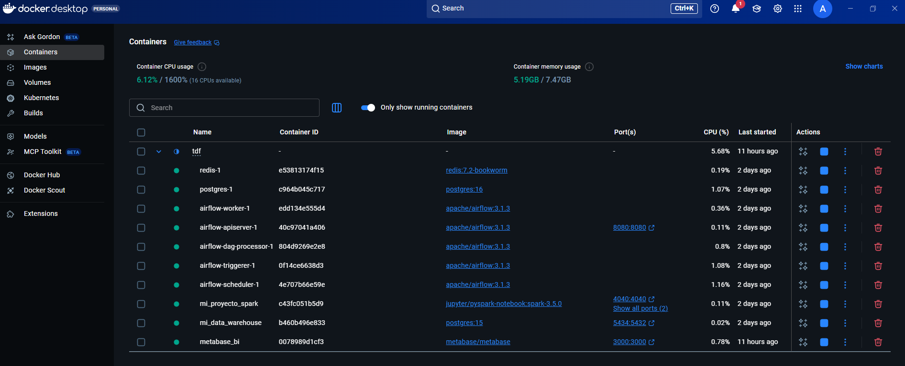

# 🌬️ Patagonia Climate Data Pipeline: End-to-End ETL 1975–2025

**My Flagship Data Engineering Project**

My primary goal was to design and build a scalable, reproducible ELT (Extract, Load, Transform) pipeline to ingest 50 years of hourly meteorological data for the Río Grande region (Tierra del Fuego). This project showcases the complete data lifecycle, from a third-party API to the final BI layer.

## ⚙️ 1. Core Technologies

| Category | Tool | Function in the Project |
| :--- | :--- | :--- |
| **Orchestration** | **Apache Airflow** | Managing historical backfills and ensuring daily incremental execution. |
| **Staging / Data Lake** | Open-Meteo API, **AWS S3** | Data ingestion and raw data persistence using cloud object storage. |
| **Processing** | **PySpark** | Distributed transformation, flattening nested JSON arrays, and type casting. |
| **Data Warehouse** | PostgreSQL (Docker) | Final, clean, and queryable analytical storage layer (OLAP). |
| **Visualization** | **Metabase** | BI layer used for quality assurance and data consumption. |
| **Environment** | **Docker / Docker Compose** | Guaranteeing 100% project reproducibility across environments. |

***

## 🐳 2. Infrastructure and Reproducibility

The entire data platform—including the Airflow scheduler, Spark runtime, and PostgreSQL warehouse—is defined via a single Docker Compose configuration, ensuring the environment is stable and portable.


### Proof of Containerized Environment

This view confirms that all necessary services are running, interconnected via Docker's internal network, and ready for execution.




***

## 📥 3. Ingestion and Data Lake Strategy

### A. Airflow: Backfilling and Idempotency

I utilized Airflow to manage the massive historical backfill starting from 1975. The DAG is intentionally designed to be **idempotent**, allowing for safe retries without duplicating data in the staging area.

**Airflow DAG Snippet (Backfill Configuration):**

```python
import requests
import boto3
from botocore.exceptions import NoCredentialsError, ClientError

BUCKET_NAME = "datariogrande"
LAT = -53.776
LON = -67.703
URL = "https://archive-api.open-meteo.com/v1/archive"

def ingest_year_to_s3(year):
    S3_KEY = f"raw/weather/year={year}/riogrande_{year}.json"
    s3 = boto3.client('s3')
    params = {
        "latitude": LAT,
        "longitude": LON,
        "start_date": f"{year}-01-01",
        "end_date": f"{year}-12-31",
        "hourly": "temperature_2m,relative_humidity_2m,surface_pressure,wind_speed_10m,wind_direction_10m,wind_gusts_10m",
        "timezone": "America/Argentina/Ushuaia"
    }
    print(f"Connecting to Open-Meteo API")
    
    try:
        with requests.get(URL, params=params, stream=True) as response:
            response.raise_for_status() # Stop if error
            response.raw.decode_content = True # Decode GZIP on the fly
            print(f"Uploading response to S3 bucket")
            s3.upload_fileobj(response.raw, BUCKET_NAME, S3_KEY) 
            
        print(f"JSON file successfully uploaded to: s3://{BUCKET_NAME}/{S3_KEY}")

    except Exception as e:
        print(f"❌ Error: {e}")
        raise(e)

```


**Airflow UI Execution Proof:**
This visual confirms the successful completion of the entire 50-year history load, validating the pipeline's robustness.


### B. S3 Staging and Hive Partitioning

Raw JSON files were streamed directly to S3 and organized using the **Hive Partitioning** convention. This decision is fundamental for read performance optimization.

**S3 Data Lake Structure:**

```text
s3://datariogrande/
└── raw/
    └── weather/
        ├── year=1975/
            └── riogrande_1975.json
        ├── year=1976/
            └── riogrande_1976.json
            .
            .
            .
        ├── year=2024/
            └── riogrande_2024.json
        └── year=2025/
            └── riogrande_2025.json
```

***

## ✨ 4. Distributed Transformation (PySpark)

This stage addresses the core engineering challenge: transforming the columnar JSON arrays into a normalized, row-oriented table format suitable for SQL analytics.

### A. The Core Logic: Flattening Parallel Arrays

The solution utilizes native Spark functions (`arrays_zip` and `explode`) to convert the nested columnar data into discrete rows, ensuring that the Timestamp and corresponding metrics are correctly aligned in parallel.

**PySpark Transformation Snippet:**


```python
from pyspark.sql import SparkSession
from pyspark.sql.functions import col, explode, arrays_zip, to_timestamp, lit
from pyspark.sql.types import StructType, StructField, StringType, DoubleType, DateType, FloatType, IntegerType, TimestampType
import os

spark = SparkSession.builder \
    .appName("TransformacionClima") \
    .config("spark.jars.packages", "org.postgresql:postgresql:42.7.2,org.apache.hadoop:hadoop-aws:3.3.4,com.amazonaws:aws-java-sdk-bundle:1.12.262") \
    .config("spark.hadoop.fs.s3a.impl", "org.apache.hadoop.fs.s3a.S3AFileSystem") \
    .config("spark.hadoop.fs.s3a.aws.credentials.provider",
            "org.apache.hadoop.fs.s3a.SimpleAWSCredentialsProvider") \
    .config("spark.hadoop.fs.s3a.endpoint", "s3.amazonaws.com") \
    .getOrCreate()

path = "s3a://datariogrande/raw/weather/" 
df_raw = spark.read.json(path)
df_zipped = df_raw.withColumn("zipped_metrics", 
    arrays_zip(
        col("hourly.time"),
        col("hourly.temperature_2m"),
        col("hourly.relative_humidity_2m"),
        col("hourly.surface_pressure"),
        col("hourly.wind_speed_10m"),
        col("hourly.wind_direction_10m"),
        col("hourly.wind_gusts_10m")
    )
).drop("hourly")

df_exploded = df_zipped.withColumn("data", explode("zipped_metrics"))
df_final = df_exploded.select(
    # Dimensiones estáticas
    col("latitude").alias("latitud").cast(FloatType()),
    col("longitude").alias("longitud").cast(FloatType()),
    col("year").cast(IntegerType()), # Columna de la partición de Hive
    
    # Hechos (Accedemos a los campos con el nombre original de la API)
    # Ejemplo: 'data' (el struct explotado) contiene el campo 'time'
    to_timestamp(col("data.time")).alias("time"), 
    
    col("data.temperature_2m").alias("temperature").cast(FloatType()),
    col("data.relative_humidity_2m").alias("relative_humidity").cast(FloatType()),
    col("data.surface_pressure").alias("surface_pressure").cast(FloatType()),
    col("data.wind_speed_10m").alias("wind_speed").cast(FloatType()),
    col("data.wind_direction_10m").alias("wind_direction").cast(IntegerType()),
    col("data.wind_gusts_10m").alias("wind_gusts").cast(FloatType())
    
).filter(col("time").isNotNull())
df_final.show()

DB_PROPERTIES = {
    "driver": "org.postgresql.Driver"
}

JDBC_URL = "jdbc:postgresql://data_warehouse:5432/clima_db"
TABLE = "weather_data"

df_final.write \
    .mode("overwrite") \
    .jdbc(JDBC_URL, TABLE, properties=DB_PROPERTIES)
```


### B. Final Data Warehouse Load

The clean, final DataFrame is written to the PostgreSQL Data Warehouse using the **JDBC connector**, ensuring proper schema mapping and reliable bulk transfer.

**PostgreSQL Table Head:**


***

## 📊 5. Data Consumption & Validation

The project concludes by validating the data's quality and accessibility through a standard BI tool.

### Metabase Dashboard Proof

The dashboard provides visual confirmation that the data is correctly aggregated, parsed, and ready for analysis.


**Dashboard Validation Highlights:**
The dashboard proves that the **Type Casting** was successful (enabling `AVG` calculations) and confirms the data is suitable for advanced analytical queries across the full 50-year history.
